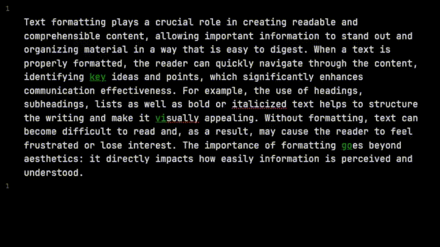

> [для понимающий Русский](README.md)  

# Just a Teaser

> [!Tip]  
> This plugin **works correctly with text selection**  
> in VIM mode:  
> - **VISUAL**  
> - **VISUAL LINE**

# Heylo My Friends

There are tons of plugins that do similar things or even the same. So why create this one?

> This **plugin works properly** in **VIM VISUAL mode**.  
> You can configure your **vimrc** and use a leader key combo to format selected text as **bold**, *italic*, and more via a ***command list***.

If you're not a VIM user, check out what the plugin can do — it enhances the basic text formatting functionality.

# We Couldn't, Now We Can
- Commands for formatting as **bold – highlight – italic – strikethrough – code – comments**
- Combine multiple formatting styles
- Remove formatting from a selected block
- Delete formatting
- Format a word in `NORMAL` mode
- ...and more I forgot to mention

## Here's How It Works

<p align="center">
  
</p>

## Planned Features
- [ ] Proper support for non-vim selection mode  
- [ ] `clear format` command  
- [ ] Jump to next formatting  
- [ ] Format the formatting (meta!)  
- [ ] Format part of a sentence, or the whole sentence

# Installation & Usage

For regular users, the plugin also works — you just need to bind the plugin's commands to hotkeys and enjoy the formatting process.

## For ❤️ Vimers ❤️

The plugin shines when you create a `.vimrc` file. To do this, install this plugin:  
> - **Vimrc Support** https://github.com/esm7/obsidian-vimrc-support  
Implements `.vimrc` behavior.  
By default, the file should be located at: `path/to/VaultName/.obsidian.vimrc` — this is configurable in Vimrc Support settings.

**You’ll need** to create a VIM command for each plugin command.

Here’s an example `.vimrc` to format text as bold.  
In **VISUAL** or **VISUAL LINE** mode, pressing `!b` or `<Space>b` will format the selected text as bold.  
In normal mode, use `<Space>efb`.

```vim
" bold 
exmap toggleBoldCommand obcommand vim-marker-sharpener:toggle-bold
map <Space>efb :toggleBoldCommand<CR>
vmap <Space>b :toggleBoldCommand<CR>
vmap !b :toggleBoldCommand<CR>
```

And here's a full example of my `.vimrc` for all commands:

```vim
" bold 
exmap toggleBoldCommand obcommand vim-marker-sharpener:toggle-bold
map <Space>efb :toggleBoldCommand<CR>
vmap <Space>b :toggleBoldCommand<CR>
vmap !b :toggleBoldCommand<CR>

" highlight
exmap toggleHighlightCommand obcommand vim-marker-sharpener:toggle-highlight
map <Space>efh :toggleHighlightCommand<CR>
vmap !h :toggleHighlightCommand<CR>
vmap <Space>h :toggleHighlightCommand<CR>

" italic
exmap toggleItalicCommand obcommand vim-marker-sharpener:toggle-italic
map <Space>efi :toggleItalicCommand<CR>
vmap !i :toggleItalicCommand<CR>
vmap <Space>i :toggleItalicCommand<CR>

" strikethrough
exmap toggleStrikethroughCommand  obcommand vim-marker-sharpener:toggle-strikethrough
map <Space>efs :toggleStrikethroughCommand<CR>
vmap !s :toggleStrikethroughCommand<CR>
vmap <Space>s :toggleStrikethroughCommand<CR>

" code 
exmap toggleCodeCommand obcommand vim-marker-sharpener:toggle-code
map <Space>efc :toggleCodeCommand<CR>
vmap !c :toggleCodeCommand<CR>
vmap <Space>c :toggleCodeCommand<CR>

" comments
exmap toggleCommentComment obcommand vim-marker-sharpener:toggle-comment
map <Space>efm :toggleCommentComment<CR>
vmap !m :toggleCommentComment<CR>
vmap <Space>m :toggleCommentComment<CR>
```